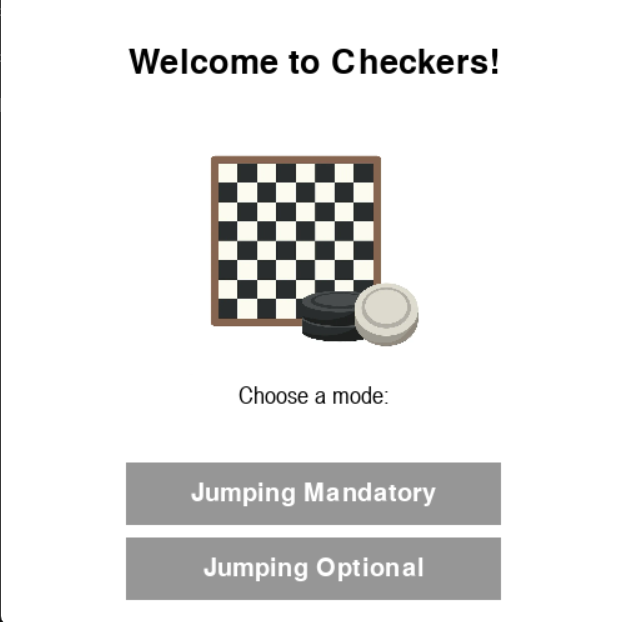

# Checkers AI with Minimax Algorithm

## Overview
This is a GUI-based checkers game where the player competes against an AI opponent powered by the Minimax algorithm with Alpha-Beta pruning. The AI evaluates board positions and selects optimal moves based on a heuristic evaluation function. The game is implemented in Python.

## Features
- **Graphical User Interface (GUI)** for an interactive checkers experience.
- **AI Opponent** using the Minimax algorithm with Alpha-Beta pruning for optimized decision-making.
- **Heuristic Evaluation Function** to assess board positions.
- **Transposition Table** to store previously computed positions and improve performance.
- **Different Modes** that influence AI behavior and difficulty.

## Minimax Algorithm Implementation
The AI determines the best move using the Minimax algorithm, which:
1. **Explores possible game states** up to a defined depth.
2. **Evaluates each position** using a custom heuristic function.
3. **Uses Alpha-Beta pruning** to optimize the search and eliminate unnecessary computations.
4. **Stores board positions** in a transposition table to avoid redundant calculations.

## Heuristic Evaluation Function
The heuristic function considers:
- Piece count (regular pieces and kings).
- Board control (central vs. edge positions).
- Mobility (number of possible moves).
- Threats and vulnerabilities.

## Getting Started
### Prerequisites
- Python 3.x
- Required libraries: `pygame`, `copy`

### Installation
1. Clone this repository:
   ```sh
   git clone https://github.com/yourusername/checkers-ai.git
   ```
2. Install dependencies:
   ```sh
   pip install pygame
   ```
3. Run the game:
   ```sh
   python main.py
   ```

## Screenshots

### Possible moves for king 


### Possible moves for pawn 


### Welcome screen



## Future Improvements
- Enhance AI difficulty settings.
- Support multiplayer mode.

## Credits

The heuristic evaluation function used in this project is adapted from [kevingregor/Checkers](https://github.com/kevingregor/Checkers).


## License
This project is open-source and available under the MIT License.

